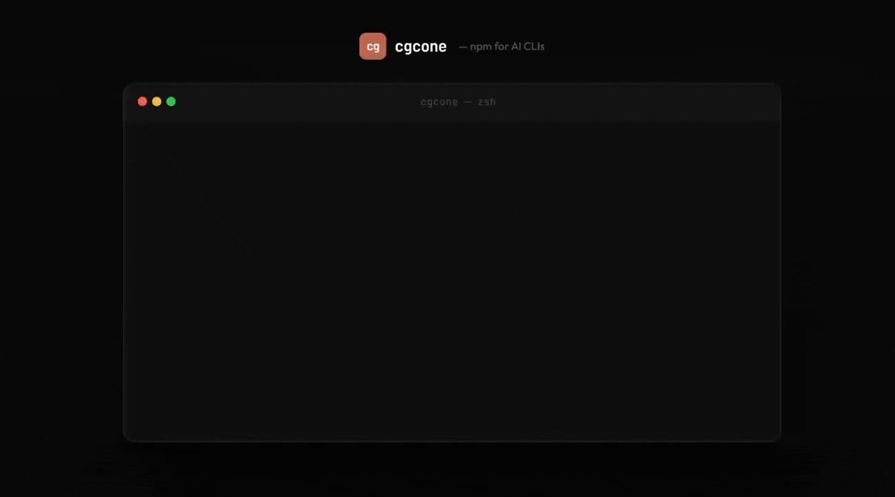
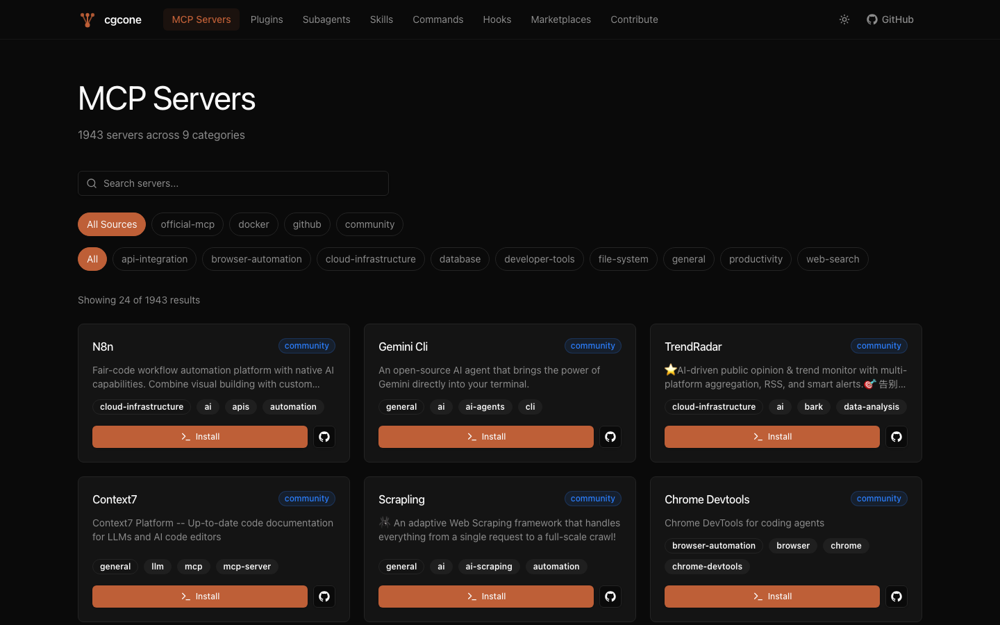

# cgcone

**The package manager for AI CLI extensions.**  
One command installs any MCP server, plugin, or skill across every AI CLI on your machine.

```bash
npm install -g @cgcone/cli
cgcone install context7
```

[](https://www.npmjs.com/package/@cgcone/cli)
[](https://www.npmjs.com/package/@cgcone/cli)
[](LICENSE)
[](https://nodejs.org)



---

## What it does

You have Claude Code. Maybe Gemini CLI. Maybe OpenAI Codex. Each has its own config format, its own file location, its own way to add MCP servers. **cgcone abstracts that away.**

```
$ cgcone scan
  ✓ Claude Code    ~/.claude.json
  ✓ Gemini CLI     ~/.gemini/settings.json
  ✓ OpenAI Codex   ~/.codex/config.toml

$ cgcone install brave-search
  Multiple matches - select one to install:
  ● Brave Search  brave-brave-search-mcp-server  [npm]
  ○ docker-brave-search                          [docker]

  Does this MCP require API keys or env vars? ● Yes
  BRAVE_API_KEY - Your Brave Search API key:  ••••••••••

  ✓ Claude Code  → configured
  ✓ Gemini CLI   → configured
  ✓ OpenAI Codex → configured
  ✓ brave-brave-search-mcp-server installed
```

---

## Install

Requires **Node.js 18+**.

```bash
npm install -g @cgcone/cli
```

---

## Supported CLIs

| CLI | Config file | Status |
|-----|-------------|--------|
| [Claude Code](https://claude.ai/code) | `~/.claude.json` | ✅ |
| [Gemini CLI](https://github.com/google-gemini/gemini-cli) | `~/.gemini/settings.json` | ✅ |
| [OpenAI Codex](https://github.com/openai/codex) | `~/.codex/config.toml` | ✅ |
| [GitHub Copilot CLI](https://docs.github.com/en/copilot/using-github-copilot/using-github-copilot-in-the-command-line) | `~/.copilot/mcp-config.json` | ✅ |

---

## Commands

```bash
# Discover
cgcone scan                               # detect AI CLIs installed on this machine
cgcone search <query>                     # search 2400+ extensions in the registry
cgcone search <query> --type npm          # filter by type: npm | uvx | docker | skill | plugin | remote
cgcone info <name>                        # show details, author, install type, install config

# Install & manage
cgcone install <name>                     # install to all detected CLIs (interactive picker if multiple matches)
cgcone install <name> --for claude-code   # install to one CLI only
cgcone install <name> --dry-run           # preview config changes without writing anything
cgcone uninstall <name>                   # remove from all CLIs (fuzzy match + picker)
cgcone configure <name>                   # update API keys / env vars for an installed MCP

# Maintenance
cgcone list                               # show installed extensions per CLI
cgcone update <name>                      # update a single extension
cgcone update --all                       # update all installed extensions
cgcone doctor                             # diagnose broken installs, MCP startup, sync drift
```

### Interactive install picker

When a search query matches multiple extensions, cgcone shows an interactive selection prompt instead of auto-installing the wrong one:

```
◆ Multiple matches - select one to install:
│ ● Context7  upstash-context7  [npm]
│ ○ Context7  docker-context7   [docker]
└
```

Arrow keys to navigate, Enter to confirm. npm entries are listed first.

### API key configuration

MCPs that require API keys prompt you interactively during install. Sensitive keys are masked:

```
ℹ This MCP requires 1 env var:

◆ BRAVE_API_KEY - Your Brave Search API key
│ ••••••••••••••••••••••••••••••
└

✓ Env vars saved
```

Update them later without reinstalling:

```bash
cgcone configure brave-search
```

---

## Registry

cgcone pulls from **[cgcone.com/registry.json](https://cgcone.com/registry.json)** — 3300+ extensions indexed from:

- Official [modelcontextprotocol.io](https://registry.modelcontextprotocol.io) registry
- GitHub repositories tagged `mcp-server`, `model-context-protocol`
- Claude Code plugins (marketplace.json format)
- Claude Code skills (SKILL.md format)
- Community subagents, commands, and hooks

Registry is refreshed nightly via GitHub Actions and synced to Supabase. Browse at **[cgcone.com](https://cgcone.com)**.

---

## Website



**[cgcone.com](https://cgcone.com)** is a full marketplace UI with:
- **MCP Servers** — 1960 servers, sorted by stars, searchable by name/category/source
- **Plugins** — 1130 Claude Code plugins with one-line install commands
- **Skills** — 252 Claude Code skills
- **Subagents, Commands, Hooks** — community extensions
- Per-entry detail pages with archived warnings, last commit, stars, install command
- Light/dark mode

---

## Repository structure

```
cgcone/
├── app/                  Next.js 15 website (cgcone.com)
│   ├── mcp-server/[slug] MCP detail pages
│   ├── mcp-servers/      MCP listing
│   ├── plugin/[slug]     Plugin detail pages
│   ├── plugins/          Plugin listing
│   ├── skills/           Skills listing
│   ├── subagents/        Subagents listing
│   └── ...
├── components/           Shared UI components
├── lib/                  Shared utilities (registry, types, utils)
├── scripts/              Registry generation pipeline
│   ├── generate-registry.js        orchestrator (full rebuild)
│   ├── sync-registry.js            dedup/sync (removes dead repos, renames, star refresh)
│   ├── classify-categories.js      keyword-based category assignment (18 categories)
│   ├── upsert-supabase.js          batch upsert registry.json → Supabase
│   ├── supabase-schema.sql         Supabase table schema + RLS policies
│   ├── fetch-mcp-official.js       official MCP registry
│   ├── fetch-mcp-github.js         GitHub topic search
│   ├── fetch-mcp-docker.js         Docker Hub
│   ├── fetch-plugins-github.js     GitHub plugin search
│   ├── fetch-skills-github.js      GitHub skills search
│   └── fetch-readme.js             README batch fetcher
├── public/
│   └── registry.json               generated registry (2400+ entries)
├── packages/
│   └── cli/                        @cgcone/cli npm package
│       └── src/
│           ├── index.js            CLI entry point
│           ├── registry.js         registry fetch + search + fuzzy match
│           ├── store.js            local install tracking (~/.cgcone/)
│           ├── ui.js               chalk/ora helpers
│           ├── adapters/           per-CLI config adapters
│           │   ├── claude-code.js
│           │   ├── gemini-cli.js
│           │   ├── codex-cli.js
│           │   └── copilot-cli.js
│           └── commands/           CLI commands
│               ├── install.js      interactive install + env var prompts
│               ├── uninstall.js    fuzzy uninstall + picker
│               ├── configure.js    post-install env var management
│               ├── search.js
│               ├── list.js
│               ├── info.js
│               ├── scan.js
│               ├── doctor.js
│               └── update.js
├── content/              Community extensions (Markdown)
│   ├── subagents/
│   ├── skills/
│   ├── commands/
│   └── hooks/
├── CONTRIBUTING.md
└── LICENSE
```

---

## Roadmap status

`████████████████████░░` **88%** — 91 / 103 tasks done

| Phase | Description | Status |
|---|---|---|
| 1A | MCP servers rebuilt from GitHub (1960 entries) | ✅ Done |
| 1B | Skills discovery (252 entries) | ✅ Done |
| 1C | Plugins discovery (1130 entries) | ✅ Done |
| 1D | Dedup + sync — removes deleted repos, fixes renames, refreshes stars | ✅ Done |
| 2A/2B | Runtime detection + pre-computed installConfig | ✅ Done |
| 2D | CLI uses pre-computed installConfig from registry | ✅ Done |
| 2E | npm package name fixes (27 resolved, 138 removed) | ✅ Partial |
| 3A | Supabase tables + schema + RLS — 1960 MCPs, 252 skills, 1130 plugins | ✅ Done |
| 3C | Nightly GitHub Actions sync: classify → upsert → commit registry.json | ✅ Done |
| 4B | Star counts + sort by stars default on website listing + detail pages | ✅ Done |
| 4C | Category classification — 18 categories, 1196 entries reclassified | ✅ Done |
| 4D | `--type` filter in search + installType badge in info/search | ✅ Done |
| 4E | Quality signals: lastCommit, isArchived in CLI info + website (archived banner) | ✅ Done |
| 5A | CLI uses baked-in install config, heuristics removed from hot path | ✅ Done |
| 5B | `cgcone install <skill>` — runs `claude skill add` directly | ✅ Done |
| 5C | `cgcone install <plugin>` — shows `/plugin install` command | ✅ Done |
| 5D | Search filters: `--type`, `--installable`, sort by stars | ✅ Done |
| 5E | Version diff in `cgcone update` (`v0.1.0 → v0.2.0`) | ✅ Done |
| 5F | `cgcone install --dry-run` — preview before writing | ✅ Done |
| 5G | TOML comment preservation for Codex | ✅ Done |
| 5H | `cgcone doctor` MCP startup handshake + env var flagging | ✅ Done |
| 5I | Install-time Node version + SDK pinning warnings | ✅ Done |
| 5J | Clickable repo links (OSC 8) in search + info | ✅ Done |
| 3B | registry.json regenerated from Supabase (reverse direction) | 🔄 Pending |
| 4A | LLM summaries per entry (needs API budget) | 🔄 Pending |
| 4E | `openIssues` field in quality signals | 🔄 Pending |

Full details: [ROADMAP.md](ROADMAP.md)

---

## Regenerating the registry

Requires a GitHub token for full results (5000 req/hr vs 60 unauthenticated):

```bash
export GITHUB_TOKEN=ghp_...
npm run generate
```

Skip slow steps during development:

```bash
SKIP_GITHUB=1 SKIP_DOCKER=1 npm run generate   # official registry only (fast)
SKIP_SKILLS=1 SKIP_PLUGINS=1 npm run generate  # skip skill/plugin discovery
```

---

## Releasing the CLI

Releases are triggered by a git tag. The GitHub Actions workflow publishes to npm with [provenance attestation](https://docs.npmjs.com/generating-provenance-statements) (Verified badge on npmjs.com).

```bash
# 1. Bump version in packages/cli/package.json
# 2. Commit and push to main
# 3. Tag the release:
git tag v0.3.5 && git push origin v0.3.5
```

The `v*` tag triggers `.github/workflows/publish.yml` → `npm publish --provenance`.

**Required secret:** `NPM_TOKEN` must be set in GitHub → Settings → Secrets → Actions.

---

## Contributing

See [CONTRIBUTING.md](CONTRIBUTING.md).

| Contribution | How |
|---|---|
| Submit a skill, subagent, command, or hook | Open a PR adding a file to `content/` |
| Submit an MCP server | [Open an issue](../../issues/new?template=extension_submission.yml) |
| Bug report | [GitHub Issues](../../issues) |
| Feature request | [GitHub Issues](../../issues) |

---

## Star History

[](https://www.star-history.com/?repos=Himanshu507%2Fcgcone&type=date&legend=top-left)

---

## License

MIT - see [LICENSE](LICENSE).
